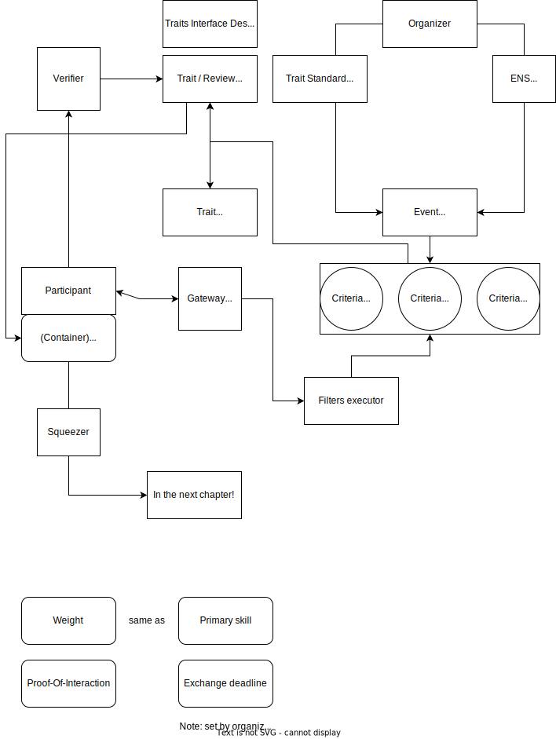

# gm_id
***Community-driven, event-focused identity.***

In an era where digital presence reigns supreme, GM ID is your passport to mastering the art of digital networking. We've fused the power of dynamic NFTs with intuitive traits, creating a symphony of identity that empowers you to make connections like never before. Plus, it's not just an dapp; it's a versatile web extension, seamlessly linking to any website, and allowing for a customized set of traits to enhance your dynamic NFT. With GM ID, your trusted digital identity is automatically curated based on your community scores.

### Benefits 
- **Unlock Deeper Connections:** Discover connections that align with your passions, skills, and needs, thanks to dynamic NFT traits.
- **Trust and Validation:** Our community-driven scoring system ensures you connect with verified and reliable peers, automatically providing a trusted digital identity.
- **Enhanced Decision-Making:** Influence community decisions based on your traits and scores, giving your voice more weight.

### Some of the problems we solve:
- **For events organizers:**
 - Reduced No-Show Rates
 - Efficient Resource Allocation
 - Enhanced Trust and Transparency
- **For users and events attendees:**
 - Tailored Connections
 - Seamless Networking
 - Community Trust
 - Digital identity scored by community

### Architecture

### Current state
we deployed new subgraphs & used one from ENS, which we use to fetch data about participants, using their ENS names.
all the contract are deployed on BASE network.

|   |   |   
|---|---|     
|Trait:| 0xD44cB6Caa186a7d39E91A4420c3D33F44F1cEE91|
|EventPass:| 0xc1afCC5d9b882A9fBd440E04C1D2AD7940f4ff34
|IdentController:| 0xa6a508c3F1EA90FC2862649f581235693E95FeeB
|CriteriaFilter:| 0x3B7a17bC524cBCa67F44AE2d1B9C848C575aedC5
|Event:| 0xcE27625020d2DDC231C3Bc35f2D0C8612090FdD0
|FilterExecutor:| 0xE4B4A10aD4C8bAc033896b5Bd0Bd3A9F93473017
|EntryPoint:| 0xf666c55ffeCBE5e91fd9c995B20Fea4b9cE2778C
|EventRegistry:| 0x438bcf0C1B6987F5D0a19fba72eb23F8cFF45C13
|Users (registered, dropped):| https://api.studio.thegraph.com/query/54934/gm-id/version/latest
|Events:| https://api.studio.thegraph.com/query/54934/gm-id-events/version/latest

### Future developments
 -ENS for subdomains
 -subdao management
 -enhanced communication 
 -expansion to different blockchains

